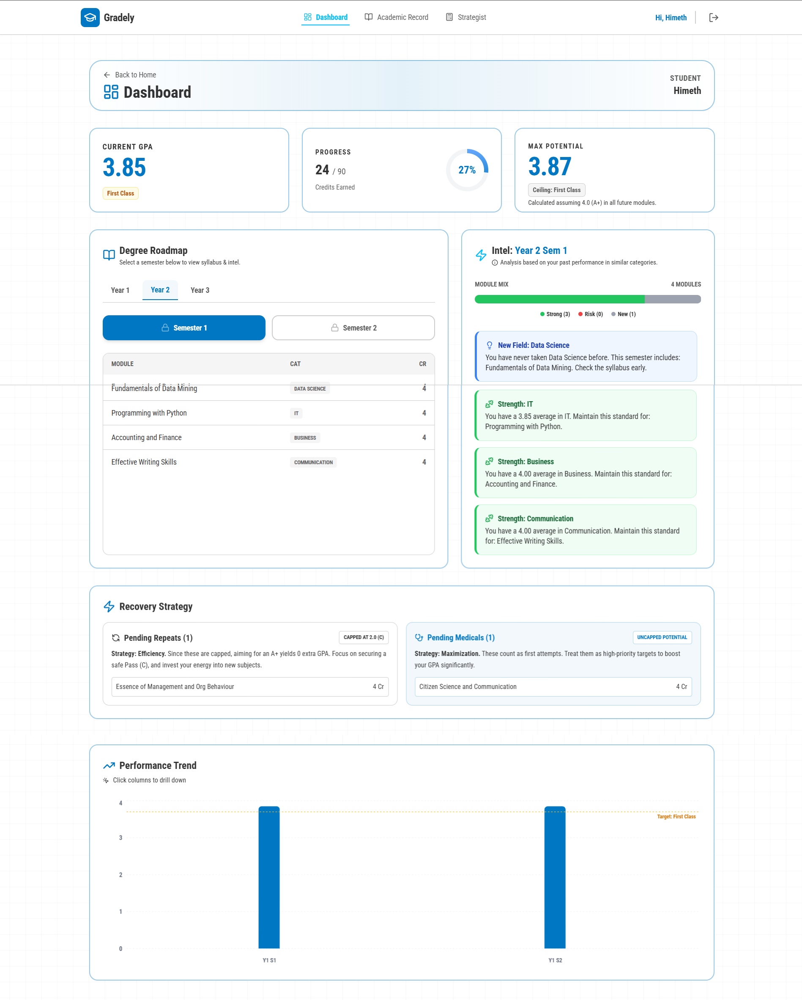

## 🎓 Gradely | Full-Stack Academic Planner & Analytics Tool

**Gradely** is a data-driven academic management application designed to help university students take control of their academic journey. It moves beyond simple calculations, offering personalized insights and goal forecasting to bridge the gap between current performance and future targets.

---

### 🚀 Key Features

- **Personalized Analytics Dashboard:** A centralized view of academic performance, visualizing trends and credit distribution.
- **Precision GPA Engine:** Handles complex academic scenarios including:
  - Repeat/Resit modules logic.
  - Medical concessions and Non-GPA modules.
  - Credit-weighted average calculations.
- **Goal Forecasting:** A predictive tool that reverse-engineers the required average grade needed to achieve a user-defined target GPA.
- **Secure Data Persistence:** Full user authentication to save and track academic records over multiple semesters.

---

### 📸 Visual Overview

#### Main Dashboard

_Figure 1: Personalized student dashboard showing GPA trends and module summaries._

#### Goal Forecasting Logic

_Figure 2: The forecasting engine calculating required grades for future targets._

---

#### 🛠️ Technical Stack

| Component    | Technology Used                                           |
| :----------- | :-------------------------------------------------------- |
| **Frontend** | React, TypeScript, Tailwind CSS                           |
| **Backend**  | Python (Flask/FastAPI), RESTful APIs                      |
| **Database** | SQL (PostgreSQL/MySQL)                                    |
| **Logic**    | Client-side TypeScript (Performance) & Server-side Python |

---

### 🏗️ Architecture & Data Logic

As a **Data Science** focused project, Gradely prioritizes data integrity and low-latency calculations:

- **Type-Safe Development:** Used **TypeScript** interfaces to ensure academic data (credits, grades, types) remains consistent across the frontend.
- **Client-Side Optimization:** GPA logic is executed on the client-side for instantaneous UI updates, reducing server load and providing a seamless user experience.
- **Relational Data Modeling:** Designed a normalized **SQL schema** to handle one-to-many relationships between users, semesters, and modules.

---
